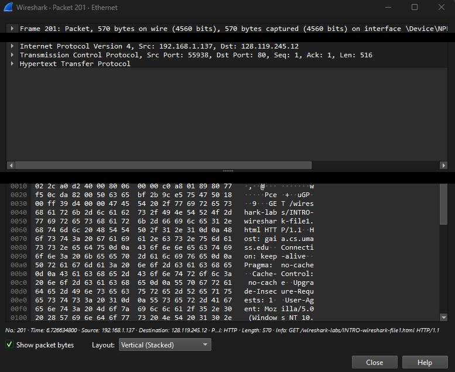
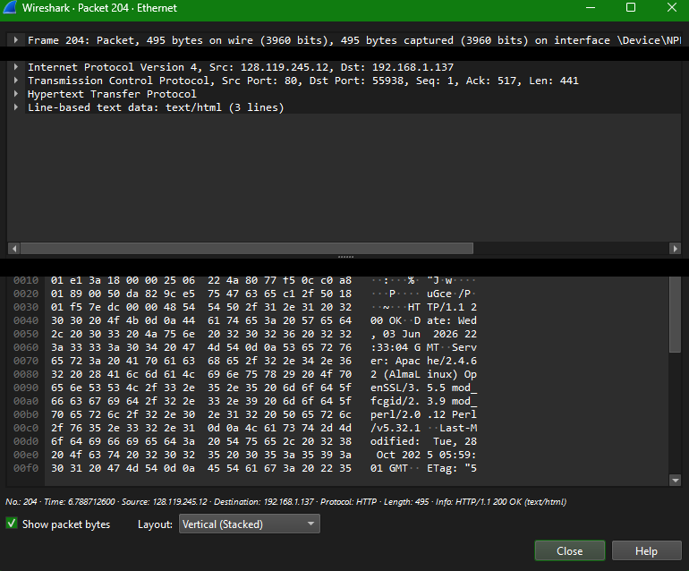

# Introduction to Wireshark Lab

This lab demonstrates basic packet capture and analysis with Wireshark, including identifying protocols in a capture, calculating round-trip time (RTT) between an HTTP request and response, and inspecting the Ethernet/IP/TCP/HTTP headers of individual packets.

## 1. Protocols Observed

Three different protocols that we saw prior to filtering are HTTP, TCP, and TLS v1.2.

## 2. Round-Trip Time Calculation

The GET packet (#201) - Time = 6.726634800
HTTP/1.1 200 OK Packet (#204) – Time = 6.788712600

**Calculations:**

6.788712600 – 6.726634800 = **0.0620778 seconds**

## 3. IP Addresses

My computer – 192.168.1.137
gaia.cs.umass.edu – 128.119.245.12

## 4. Packet Detail Screenshots

**Packet (#201)** — the HTTP GET request, showing Ethernet, IP, TCP, and HTTP header details:

**Packet (#204)** — the HTTP/1.1 200 OK response, showing Ethernet, IP, TCP, and HTTP header details:

