# Wireshark Lab - IP

This lab uses Wireshark to examine the fields of the IPv4 header and to observe how ICMP-over-IP behavior (TTL handling and datagram fragmentation) shows up in captured packets.

## Question 1

**Answer:** My computer's IP address is 192.168.1.137.

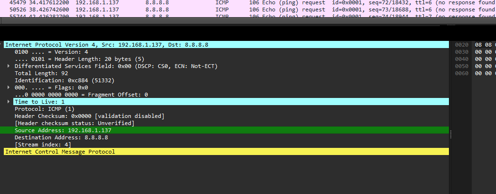

## Question 2

**Answer:** The upper layer protocol field contains ICMP (1).

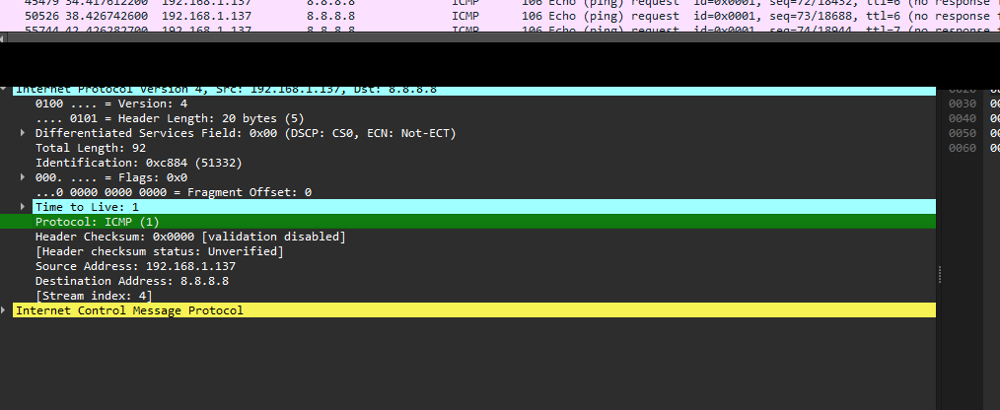

## Question 3

**Answer:** IP Header Length = 20 bytes. Total Length = 92 bytes. Payload = 92 - 20 = 72 bytes.

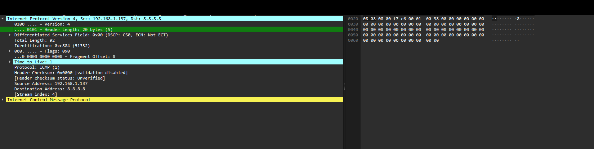

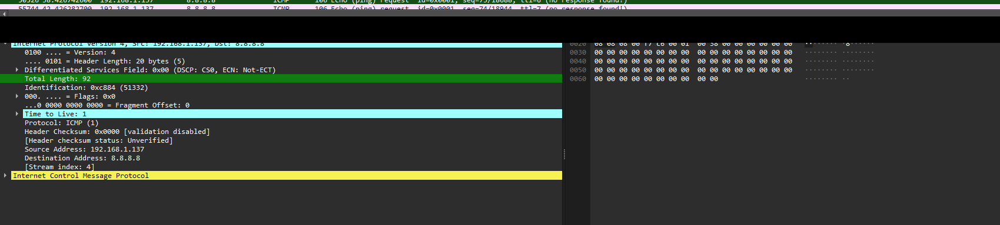

## Question 4

**Answer:** The datagram was not fragmented. Flags = 0x0 and Fragment Offset = 0.

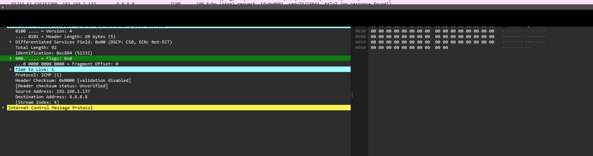

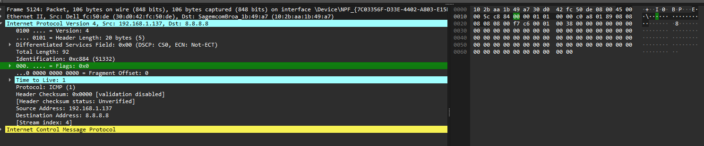

## Question 5

**Answer:** Fields that change: TTL, Identification, and Header Checksum.

## Question 6

**Answer:** Fields that remain constant: Source Address, Destination Address, Protocol, Header Length, and Total Length. Fields that change: TTL, Identification, and Header Checksum.

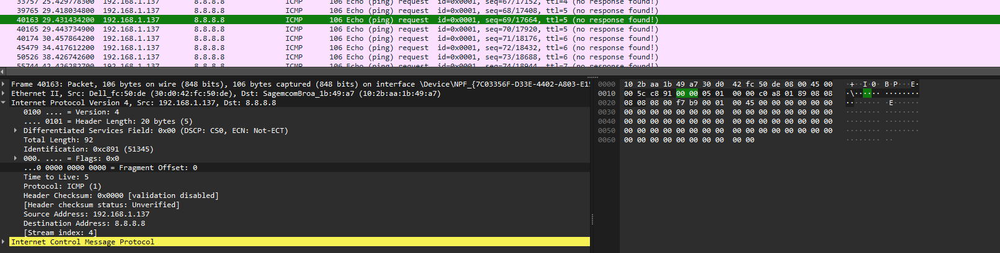

## Question 7

**Answer:** The Identification field increases sequentially as new datagrams are transmitted.

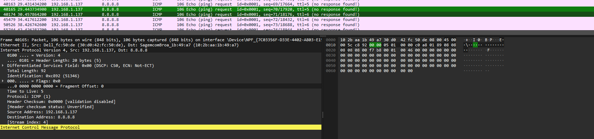

## Question 8

**Answer:** Nearest router TTL-exceeded reply: Identification = 10156, TTL = 64.

## Question 9

**Answer:** TTL remains the same for replies from the same router, while Identification changes because each packet is a separate datagram.

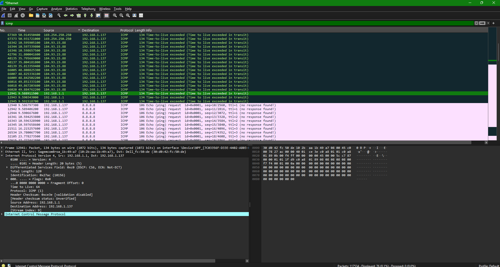

## Question 10

**Answer:** Yes. The 2000-byte ICMP Echo Request was fragmented across multiple IP datagrams.

## Question 11

**Answer:** First fragment: Total Length = 1500 bytes, More Fragments flag set, Fragment Offset = 0.

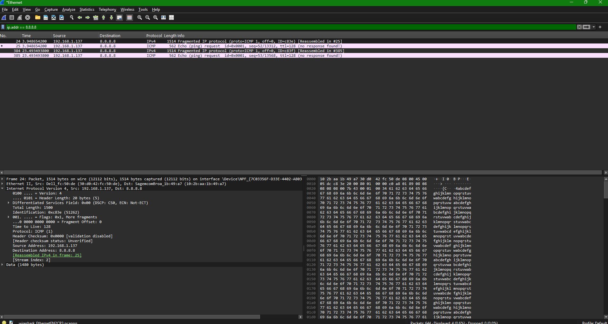

## Question 12

**Answer:** Second fragment: Fragment Offset > 0, indicating it is not the first fragment. It is typically the final fragment for a 2000-byte packet.

## Question 13

**Answer:** Fields that change between fragments: Total Length, Fragment Offset, Flags, and Header Checksum. Identification remains the same.

## Question 14

**Answer:** The 3500-byte ICMP Echo Request was fragmented into 3 fragments.

## Question 15

**Answer:** Fields that change among the fragments: Fragment Offset, Total Length, Flags (More Fragments), and Header Checksum. Identification remains the same.

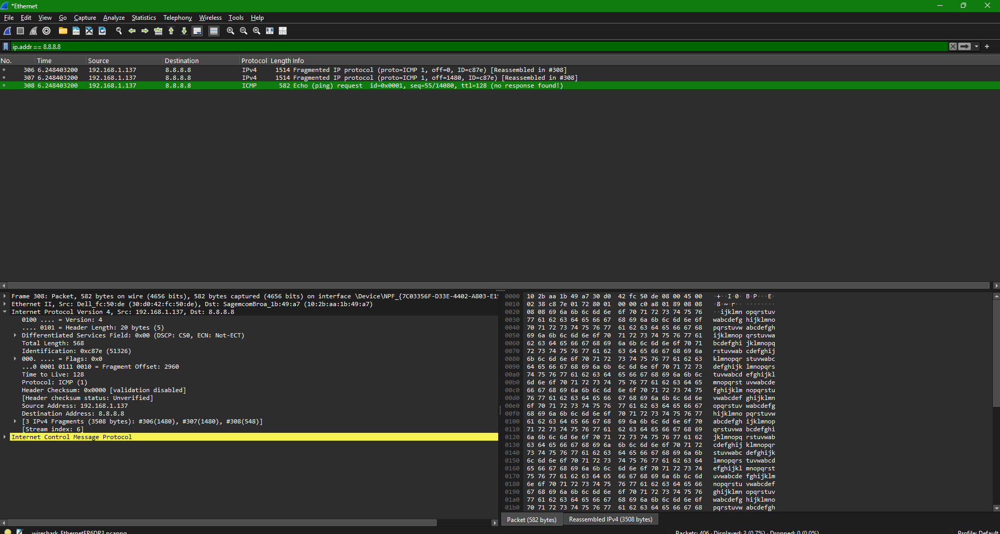
