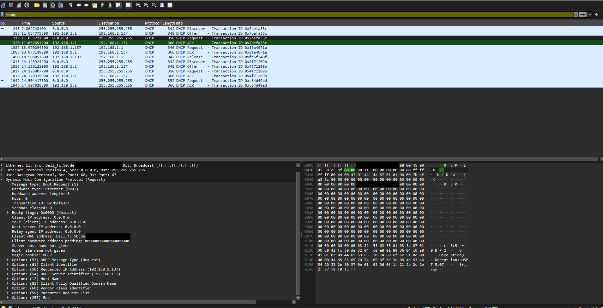
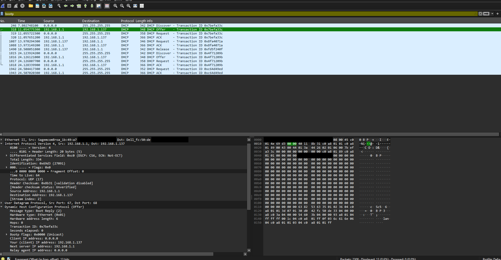
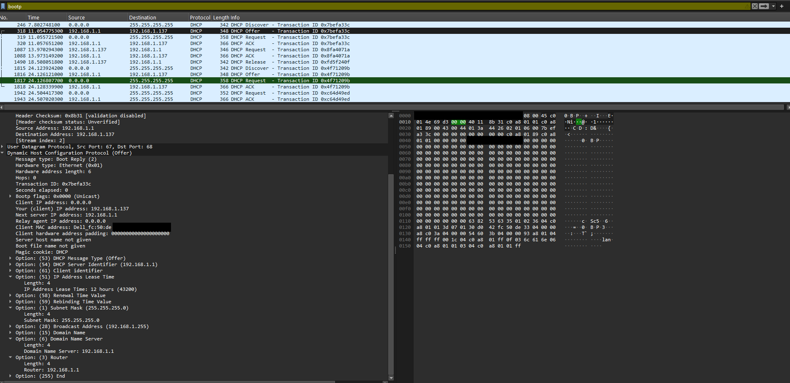
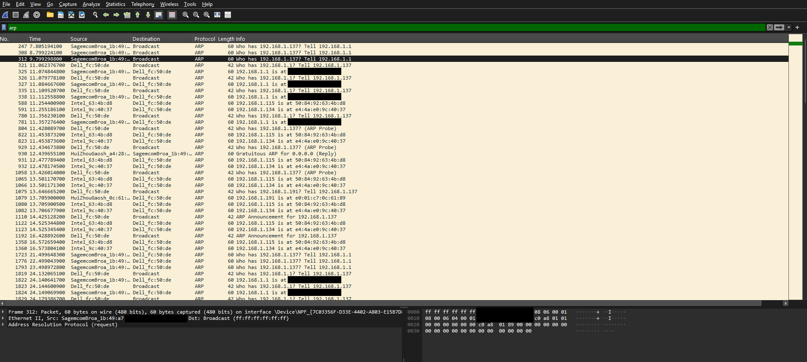

# Wireshark Lab - DHCP

This lab uses Wireshark to capture and analyze the DHCP Discover/Offer/Request/ACK message exchange a host uses to obtain an IP address lease from a DHCP server.

## 1. Are DHCP messages sent over UDP or TCP?

DHCP messages are sent using UDP. DHCP clients use UDP port 68 and DHCP servers use UDP port 67.


## 2. Draw the DHCP Discover/Offer/Request/ACK exchange.

```
Client (0.0.0.0:68) -> Server (192.168.1.1:67): DHCP Discover
Server -> Client: DHCP Offer
Client -> Server: DHCP Request
Server -> Client: DHCP ACK
```

Ports are the standard DHCP ports 67 and 68.



## 3. What is the link-layer address of your host?

30:d0:42:xx:xx:xx


## 4. What values differentiate Discover from Request?

The Request contains Option 50 (Requested IP Address 192.168.1.137), Option 54 (DHCP Server Identifier 192.168.1.1), and DHCP Message Type=Request.


## 5. Transaction IDs and purpose

First exchange: 0x7befa33c. Second Request/ACK exchange: 0x8fa4071a. Transaction IDs associate DHCP messages with the same conversation.


## 6. Source and destination IP addresses

Discover: 0.0.0.0 -> 255.255.255.255; Offer: 192.168.1.1 -> 192.168.1.137; Request: 0.0.0.0 -> 255.255.255.255; ACK: 192.168.1.1 -> 192.168.1.137.


## 7. DHCP server IP

192.168.1.1


## 8. Offered IP address

192.168.1.137


## 9. Relay agent

No relay agent present. Relay Agent IP = 0.0.0.0.


## 10. Purpose of router and subnet mask

Router identifies the default gateway (192.168.1.1). Subnet mask (255.255.255.0) identifies the local network.



## 11. Did the client accept the offer?

Yes. The client requested 192.168.1.137 and received a DHCP ACK.


## 12. Lease time

The lease time is 12 hours (43200 seconds).


## 13. Purpose of DHCP Release

It informs the server the client is giving up the address. If lost, the address remains leased until expiration.


## 14. ARP packets observed

Yes. ARP Probes, Requests, and Announcements were observed to detect duplicates and announce ownership of 192.168.1.137.




