# Wireshark Lab: NAT v7.0

This lab compares two synchronized packet captures — one taken on the home LAN side of a router and one taken on the ISP (WAN) side — to observe how Network Address Translation (NAT) rewrites a packet's source/destination IP address and recalculates its checksum while leaving TCP ports and higher-layer data unchanged.

## Question 1

What is the IP address of the client?

**Answer:**

The client IP address is 192.168.1.100.

**Proof:**

The IPv4 header of the HTTP GET packet shows:

Source Address: 192.168.1.100

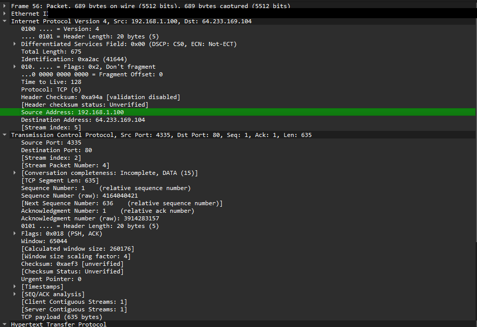

## Question 2

**Filter Used:**

```
http && ip.addr == 64.233.169.104
```

This filter displays only HTTP traffic between the client and the Google server (64.233.169.104).

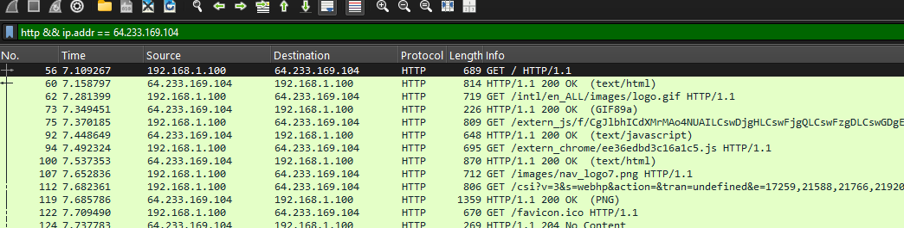

## Question 3

Consider the HTTP GET sent from the client to the Google server at time 7.109267.

**Answer:**

The HTTP GET packet was sent at time 7.109267.

- Source IP Address: 192.168.1.100
- Destination IP Address: 64.233.169.104
- Source TCP Port: 4335
- Destination TCP Port: 80

**Proof:**

The selected HTTP GET packet shows:

- Time: 7.109267
- Source Address: 192.168.1.100
- Destination Address: 64.233.169.104
- Source Port: 4335
- Destination Port: 80

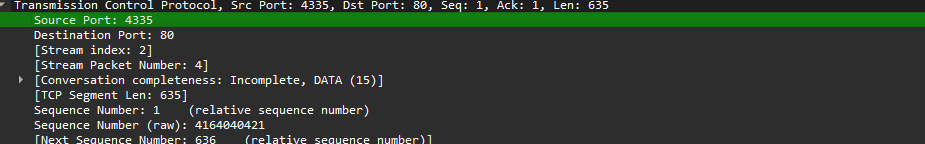
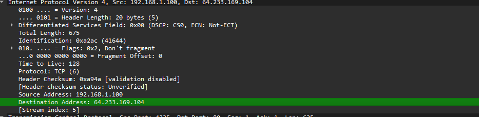
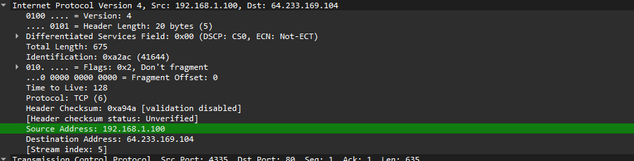
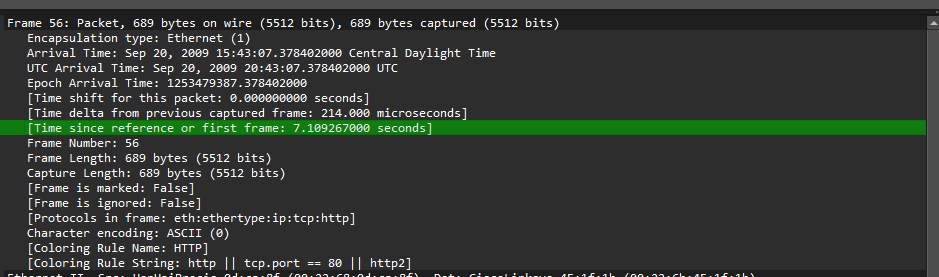
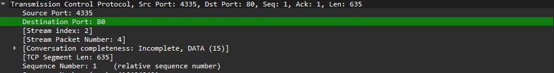

## Question 4

At what time is the corresponding HTTP 200 OK message received from the Google server?

**Answer:**

The HTTP 200 OK response was received at time 7.158797.

- Source IP Address: 64.233.169.104
- Destination IP Address: 192.168.1.100
- Source TCP Port: 80
- Destination TCP Port: 4335

**Proof:**

The HTTP/1.1 200 OK packet shows:

- Time: 7.158797
- Source Address: 64.233.169.104
- Destination Address: 192.168.1.100
- Source Port: 80
- Destination Port: 4335

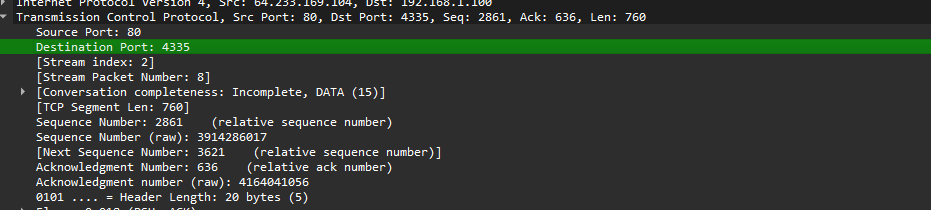
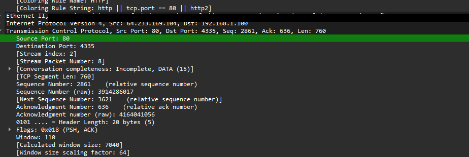
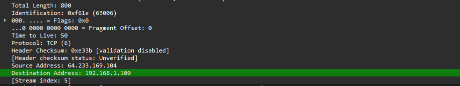
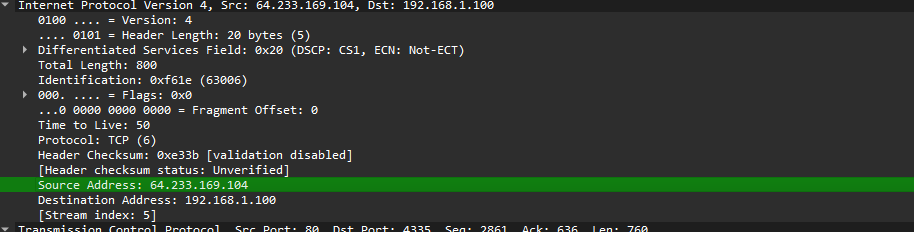
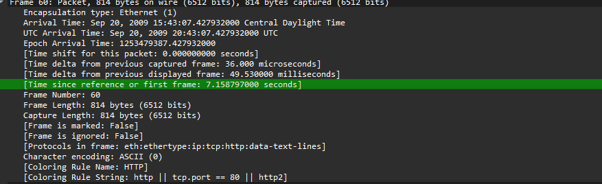

## Question 5

Recall that before a GET command can be sent to an HTTP server, TCP must first set up a connection using the three-way handshake.

**Answer:**

The TCP SYN segment was sent at time 7.075657.

- Source IP Address: 192.168.1.100
- Destination IP Address: 64.233.169.104
- Source Port: 4335
- Destination Port: 80

The SYN/ACK response was sent at time 7.108986.

- Source IP Address: 64.233.169.104
- Destination IP Address: 192.168.1.100
- Source Port: 80
- Destination Port: 4335

The ACK completing the TCP three-way handshake was received at time 7.109053.

- Source IP Address: 192.168.1.100
- Destination IP Address: 64.233.169.104
- Source Port: 4335
- Destination Port: 80

**Proof:**

- Packet 53 = SYN
- Packet 54 = SYN/ACK
- Packet 55 = ACK

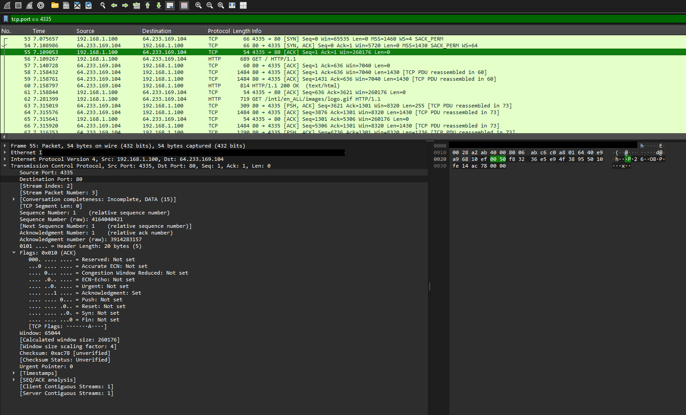
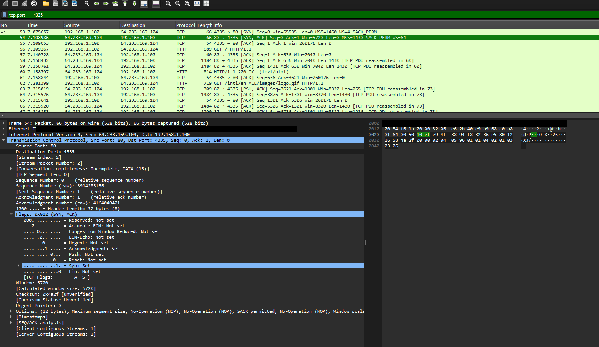
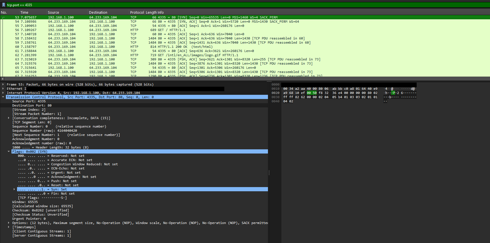

## Question 6

In the NAT_ISP_side trace file, find the HTTP GET message corresponding to the GET at time 7.109267 in NAT_home_side.

**Answer:**

The corresponding HTTP GET appears at time 6.091618.

- Source IP Address: 71.192.xx.xx *(redacted — author's real public/WAN IP)*
- Destination IP Address: 64.233.169.104
- Source TCP Port: 4335
- Destination TCP Port: 80

**Comparison with Question 3:**

Same Fields:
- Destination IP Address (64.233.169.104)
- Source Port (4335)
- Destination Port (80)

Different Fields:
- Source IP changed from 192.168.1.100 to 71.192.xx.xx (the router's public/WAN address)

**Proof:**

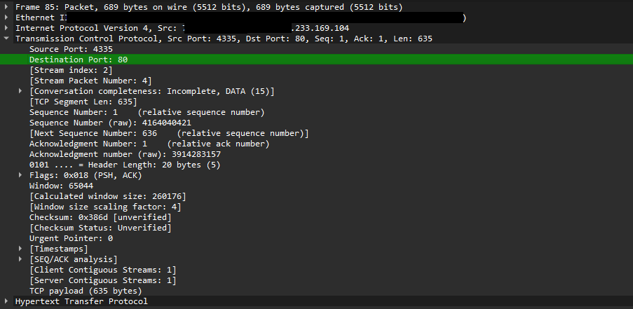
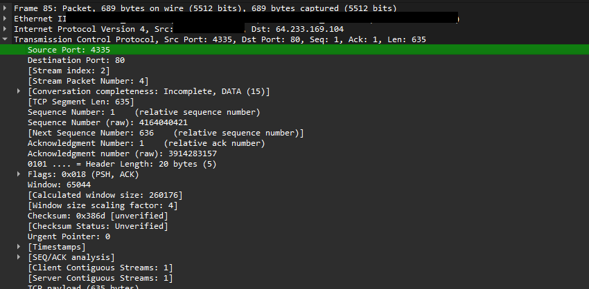
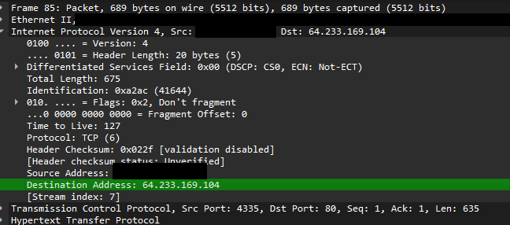
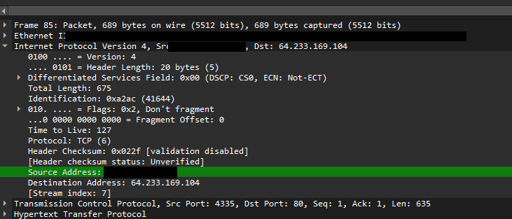
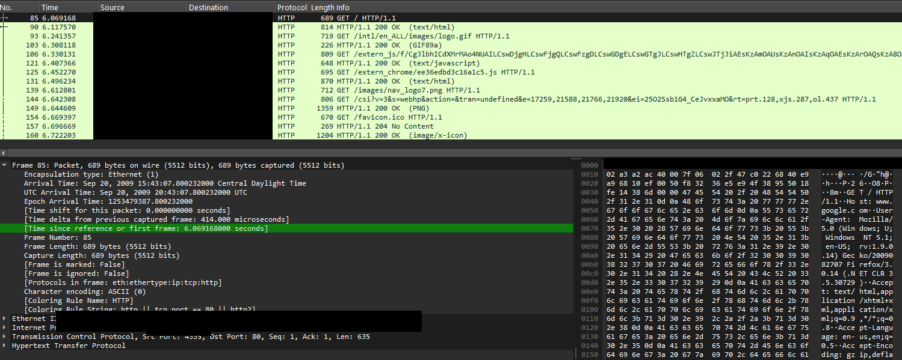

## Question 7

Are any fields in the HTTP GET message changed?

**Answer:**

The HTTP GET message itself was not changed.

The following IP header fields were examined:

- Version: No Change
- Header Length: No Change
- Flags: No Change
- Checksum: Changed

The checksum changed because NAT modified the source IP address. Since the IP header changed, the checksum had to be recalculated.

**Proof:**


## Question 8

In the NAT_ISP_side trace file, at what time is the first HTTP 200 OK message received from the Google server?

**Answer:**

The first HTTP 200 OK message was received at time 6.117570.

- Source IP Address: 64.233.169.104
- Destination IP Address: 71.192.xx.xx *(redacted — author's real public/WAN IP)*
- Source TCP Port: 80
- Destination TCP Port: 4335

**Comparison with Question 4:**

Same Fields:
- Source IP Address
- Source Port
- Destination Port

Different Fields:
- Destination IP Address changed from 192.168.1.100 to 71.192.xx.xx

**Proof:**

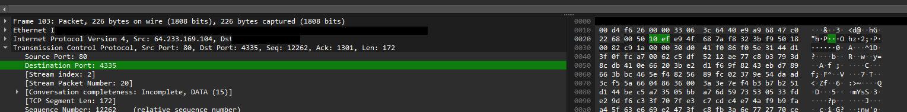
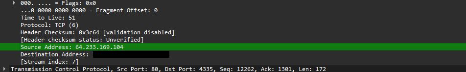
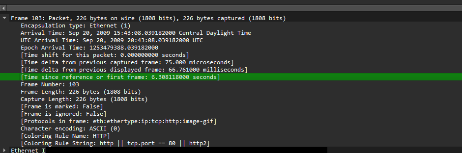

## Question 9

In the NAT_ISP_side trace file, at what time were the client-to-server TCP SYN segment and the server-to-client TCP SYN/ACK segment captured?

**Answer:**

Client-to-Server SYN:
- Time: 6.035475
- Source IP Address: 71.192.xx.xx *(redacted — author's real public/WAN IP)*
- Destination IP Address: 64.233.169.104
- Source Port: 4335
- Destination Port: 80

Server-to-Client SYN/ACK:
- Time: 6.067775
- Source IP Address: 64.233.169.104
- Destination IP Address: 71.192.xx.xx
- Source Port: 80
- Destination Port: 4335

ACK:
- Time: 6.068754
- Source IP Address: 71.192.xx.xx
- Destination IP Address: 64.233.169.104
- Source Port: 4335
- Destination Port: 80

**Comparison with Question 5:**

Same Fields:
- Source Port
- Destination Port

Different Fields:
- Private IP 192.168.1.100 was translated to Public IP 71.192.xx.xx

**Proof:**

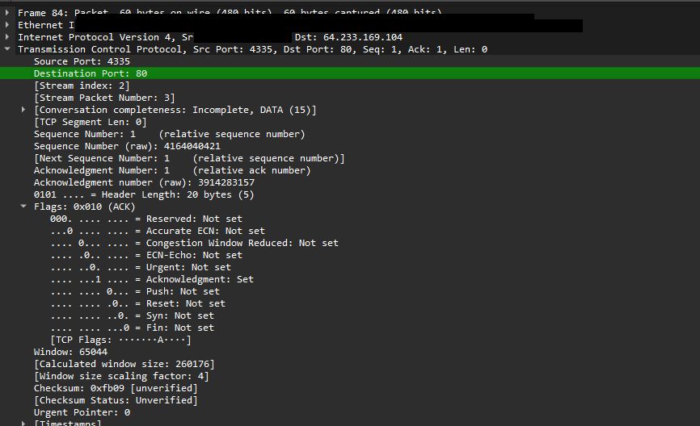
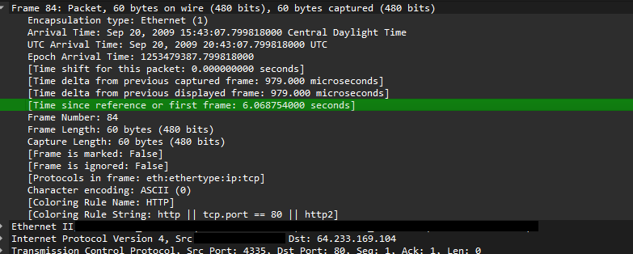
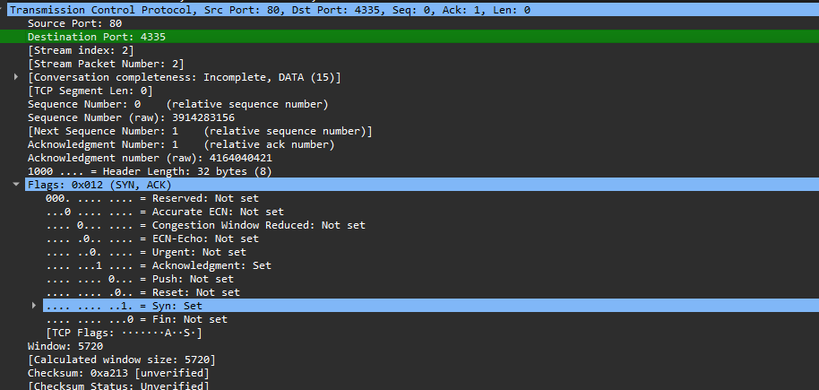
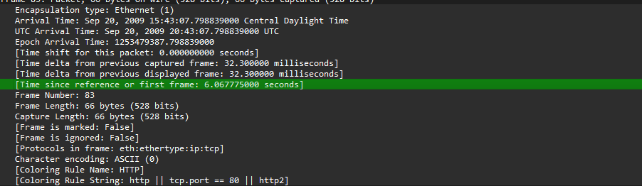
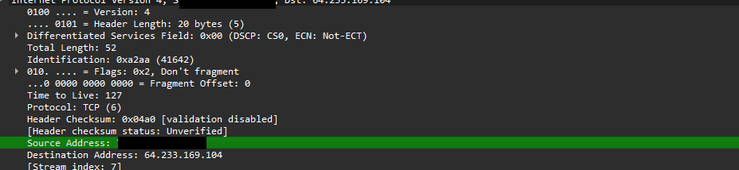
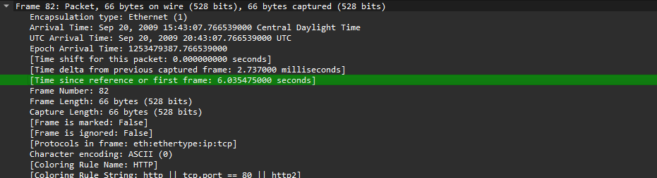
