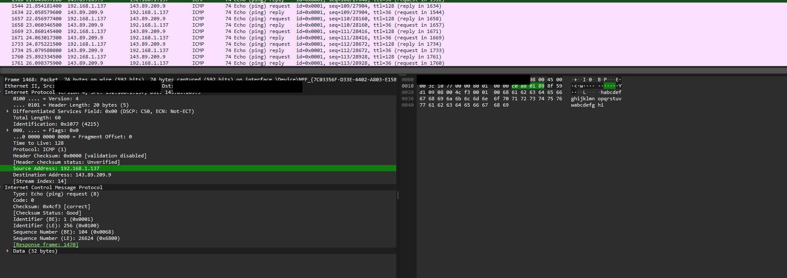
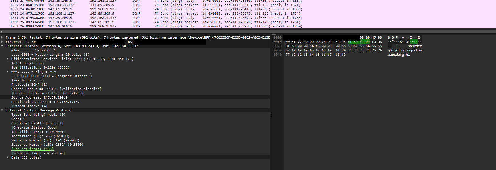
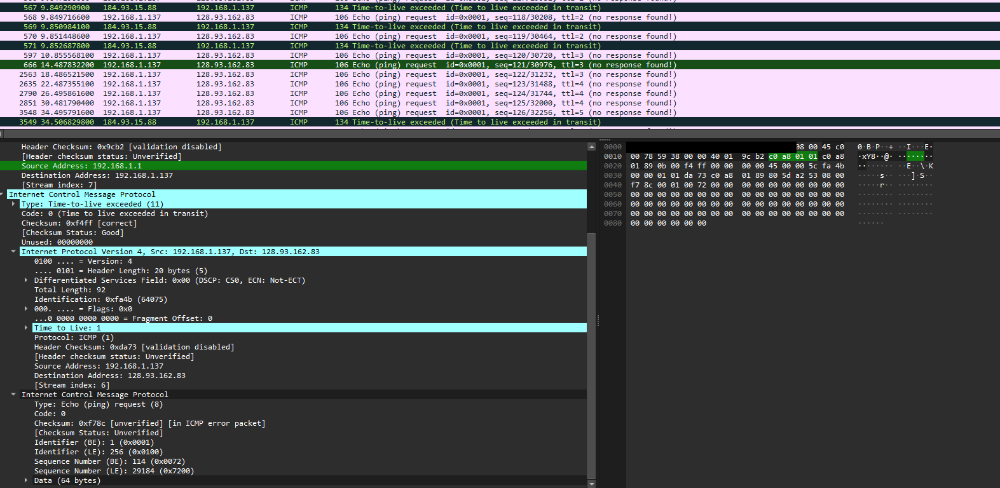
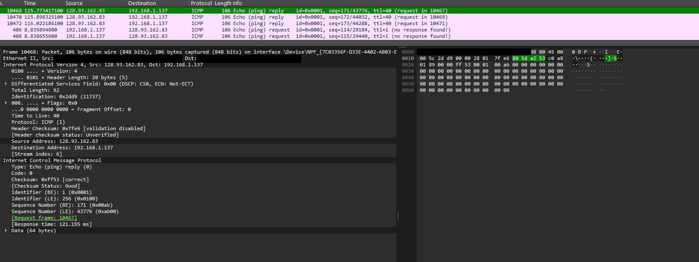
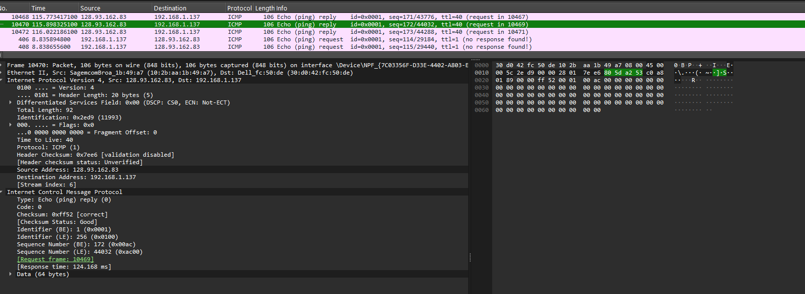
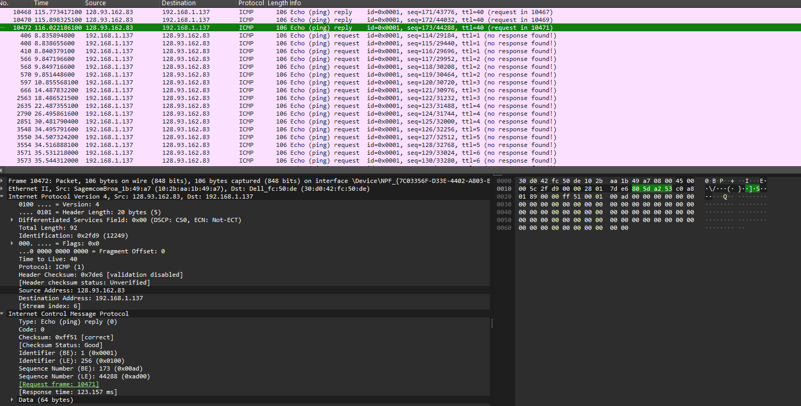
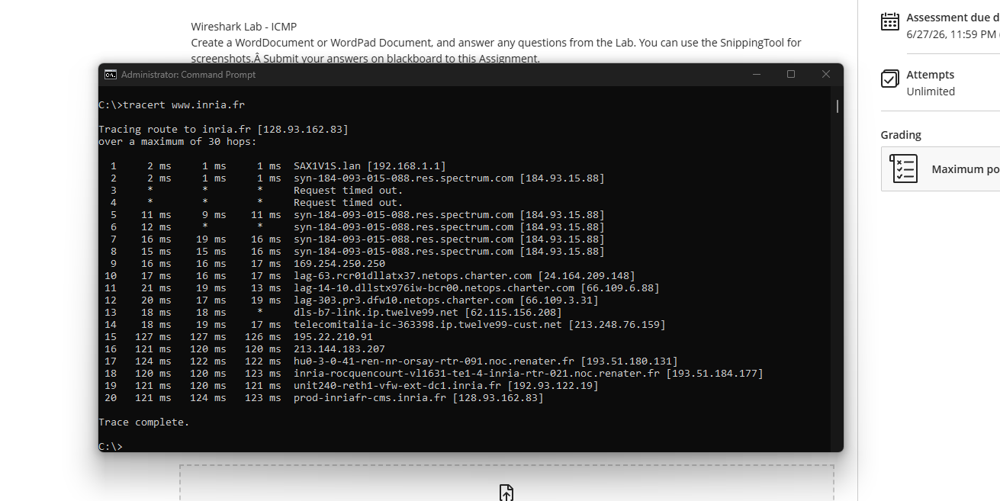

# Wireshark Lab: ICMP

This lab examines ICMP Echo Request/Reply and Time-to-Live Exceeded messages generated by `ping` and `traceroute` to understand how the ICMP protocol operates at the packet level.

## Question 1

**Answer:**

- Host IP Address: 192.168.1.137
- Destination IP Address: 143.89.209.9

## Question 2

**Answer:**

ICMP operates directly on top of IP and does not use TCP or UDP. Therefore, ICMP packets do not contain source or destination port numbers.

## Question 3

**Answer:**

- ICMP Type: 8 (Echo Request)
- Code: 0
- Fields: Checksum, Identifier, Sequence Number, Data
- Checksum = 2 bytes
- Identifier = 2 bytes
- Sequence Number = 2 bytes

## Question 4

**Answer:**

- ICMP Type: 0 (Echo Reply)
- Code: 0
- Fields: Checksum, Identifier, Sequence Number, Data
- Checksum = 2 bytes
- Identifier = 2 bytes
- Sequence Number = 2 bytes

## Question 5

**Answer:**

- Host IP Address: 192.168.1.137
- Target Destination Host: 128.93.162.83

## Question 6

**Answer:**

No. ICMP uses protocol number 1. UDP uses protocol number 17.

## Question 7

**Answer:**

The packet is still an ICMP Echo Request (Type 8, Code 0). Traceroute changes the TTL value to discover routers along the path.

## Question 8

**Answer:**

The ICMP error packet contains the Type, Code, Checksum, Unused field, original IP header, and original ICMP Echo Request information.

## Question 9

**Answer:**

The last three packets are ICMP Echo Reply packets from the destination host. Earlier packets were ICMP Time Exceeded packets from routers whose TTL expired.

## Question 10

**Answer:**

The largest delay occurs between Hop 14 and Hop 15, where latency jumps from approximately 18 ms to 127 ms. This likely represents an international backbone transition into the French RENATER network.

