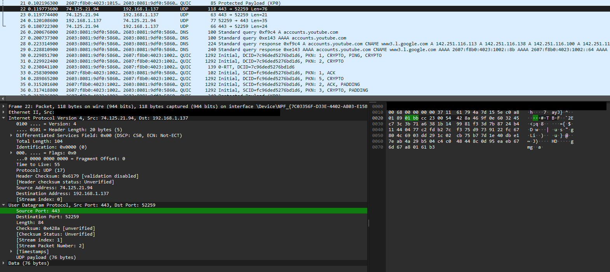
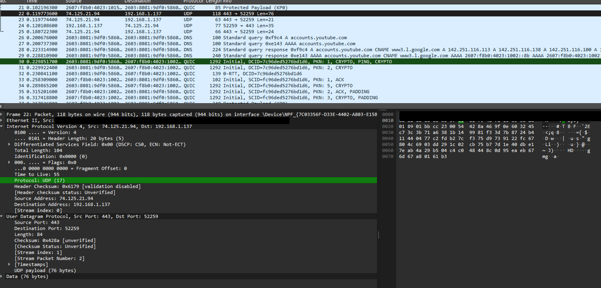
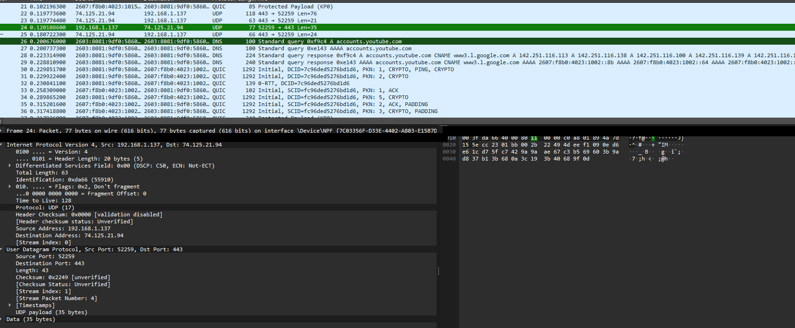
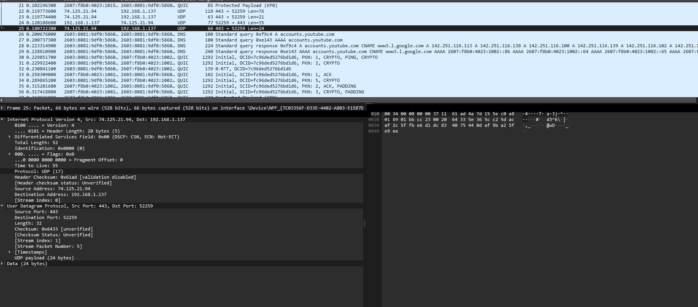

# Wireshark Lab: UDP

This lab uses Wireshark packet captures to examine the structure of the UDP header and demonstrate UDP's stateless, connectionless transport behavior.

## Question 1

The UDP header contains 4 fields: Source Port, Destination Port, Length, and Checksum.

## Question 2

Each UDP header field is 2 bytes long. Source Port = 2 bytes, Destination Port = 2 bytes, Length = 2 bytes, Checksum = 2 bytes. Total UDP header size = 8 bytes.

## Question 3

The Length field represents the total size of the UDP header and UDP payload. In the capture, Length = 84 bytes and UDP payload = 76 bytes. 8-byte header + 76-byte payload = 84 bytes.

## Question 4

The maximum UDP payload size is 65,527 bytes. UDP uses a 16-bit length field with a maximum value of 65,535 bytes, minus the 8-byte UDP header.

## Question 5

The largest possible source port number is 65,535 because port numbers are 16-bit values.

## Question 6

The protocol number for UDP is 17 in decimal and 0x11 in hexadecimal. Evidence from the IPv4 header shows Protocol: UDP (17).

## Question 7

Packet 24 and Packet 25 demonstrate a request/reply exchange. Packet 24 uses Source Port 52259 and Destination Port 443. Packet 25 reverses these values, using Source Port 443 and Destination Port 52259. The client's source port becomes the destination port in the reply, and the server's port becomes the source port in the reply.

