# Wireshark 802.11 Lab - Submission Answers

This lab uses Wireshark to capture and analyze IEEE 802.11 (WiFi) traffic, examining beacon frames, authentication, association, and probe request/response exchanges between a wireless client and an access point.

## Question 1

The two SSIDs issuing most beacon frames are '[REDACTED-SSID]' and 'linksys12'.

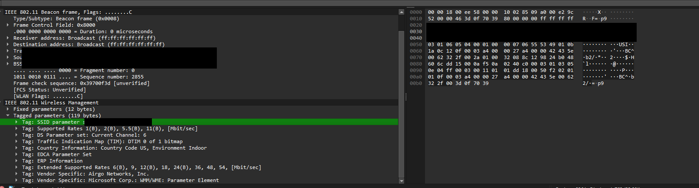

## Question 2

The beacon interval for the [REDACTED-SSID] access point is 0.102400 seconds (102.4 ms).

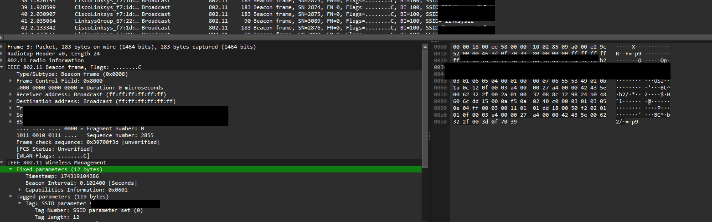

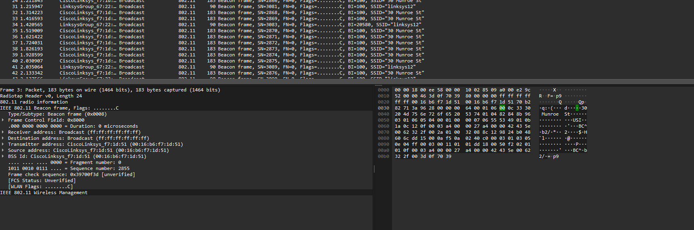

## Question 3

The source MAC address on the beacon frame from [REDACTED-SSID] is 00:16:b6:xx:xx:xx.

## Question 4

The destination MAC address on the beacon frame from [REDACTED-SSID] is ff:ff:ff:ff:ff:ff (broadcast).

## Question 5

The BSS ID on the beacon frame from [REDACTED-SSID] is 00:16:b6:xx:xx:xx.

## Question 6

Supported rates: 1, 2, 5.5, and 11 Mbps. Extended supported rates: 6, 9, 12, 18, 24, 36, 48, and 54 Mbps.

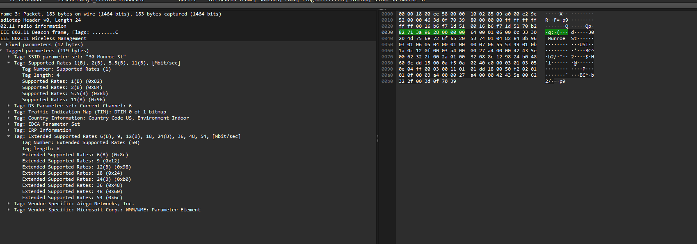

## Question 7

TCP SYN frame: Host MAC 00:13:02:xx:xx:xx, AP MAC 00:16:b6:xx:xx:xx, Router MAC 00:16:b6:xx:xx:xx. Source IP 192.168.1.109. Destination IP 128.119.245.12.

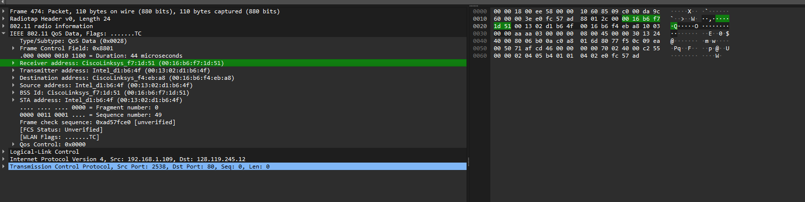

## Question 8

TCP SYN/ACK frame: Source IP 128.119.245.12, Destination IP 192.168.1.109. The sender MAC does not correspond to the original TCP sender; it corresponds to the AP forwarding traffic on the WLAN.

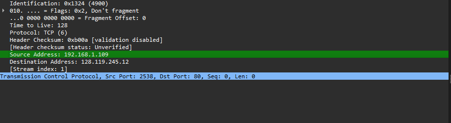

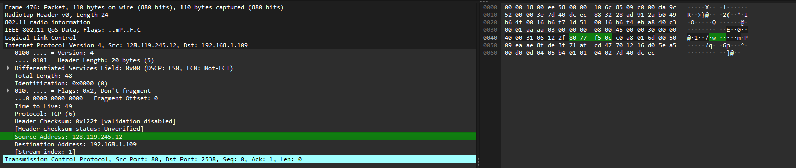

## Question 9

The host sends a DHCP Release and then an 802.11 Deauthentication frame to disconnect from the AP. A Disassociation frame might also be expected.

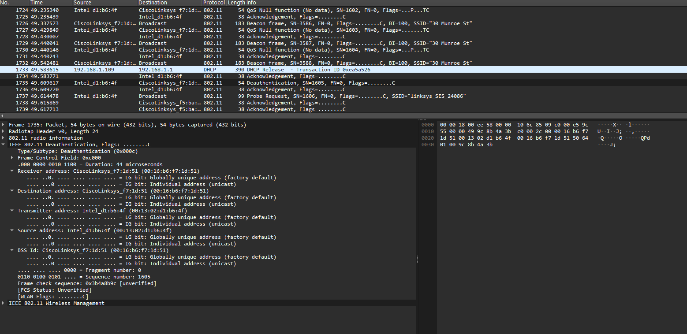

## Question 10

Sixteen Authentication messages were observed from the host to linksys_SES_24086.

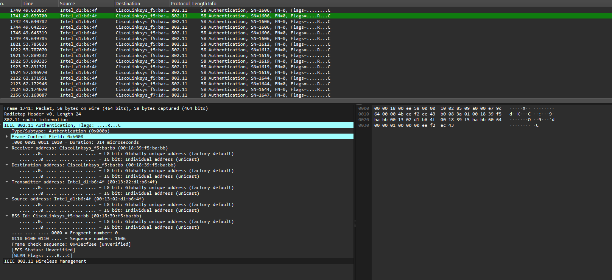

## Question 11

The host requests Open System Authentication.

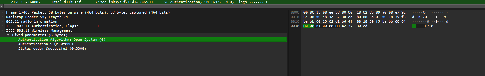

## Question 12

No Authentication reply was observed from linksys_SES_24086.

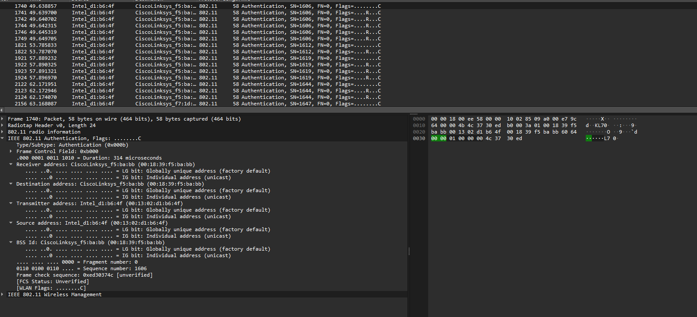

## Question 13

Authentication exchange with [REDACTED-SSID] occurred around 63.169 seconds. Response: 63.169071. Request: 63.169707.

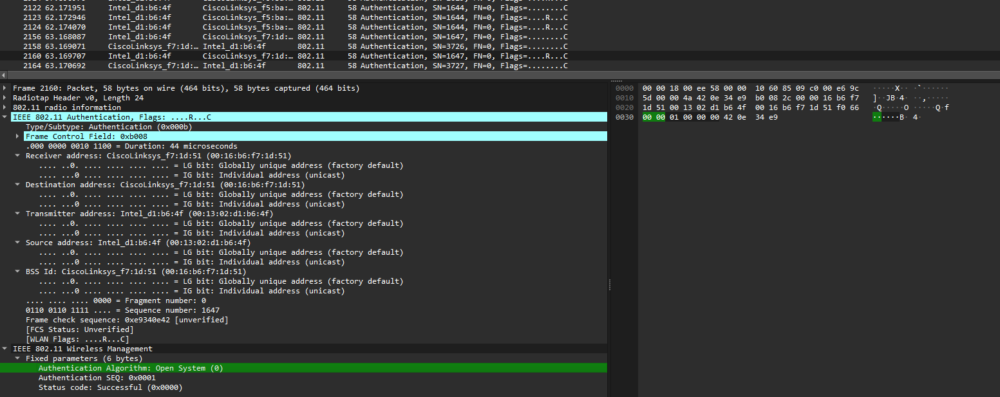

## Question 14

Association Request: 63.169910 seconds. Association Response: 63.192101 seconds.

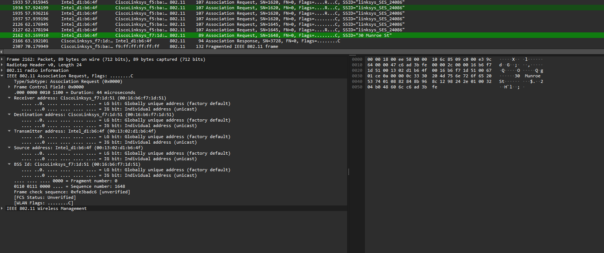

## Question 15

The host and AP both support rates from 1 Mbps through 54 Mbps.

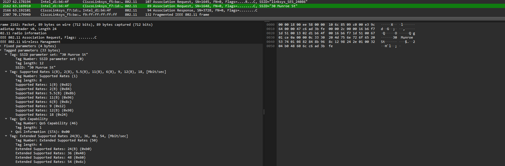

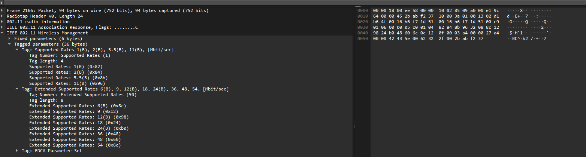

## Question 16

Probe Requests are sent by clients searching for APs. Probe Responses are sent by APs advertising their capabilities and availability.

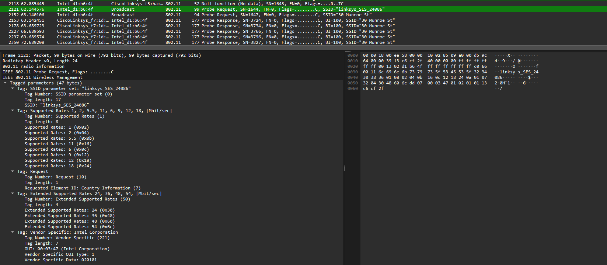
