# Wireshark DNS Lab Answers

This lab uses Wireshark to capture and analyze live DNS query and response traffic, examining transport protocol, port usage, and DNS message structure across several real-world domains.

**Question 4**
**Answer:** The DNS query and response messages were transmitted using the protocol observed in my capture. In my browser capture, DNS traffic used TCP.

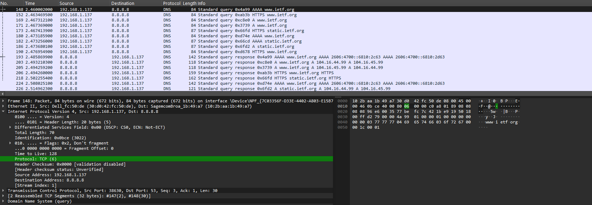

**Question 5**

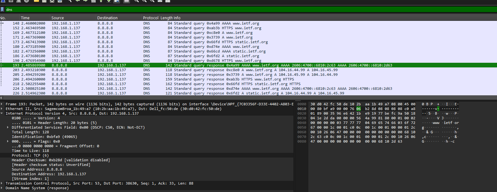

**Answer:** DNS Query Destination Port: 53. DNS Response Source Port: 53.

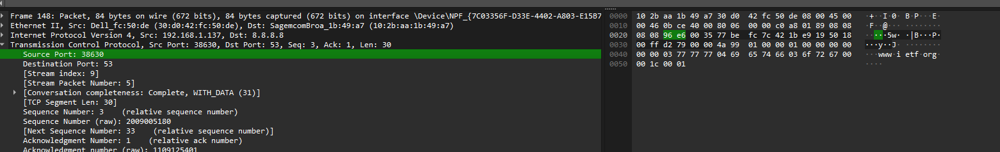
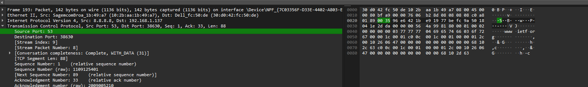

**Question 6**
**Answer:** The DNS query was sent to the configured DNS server shown in ipconfig /all.

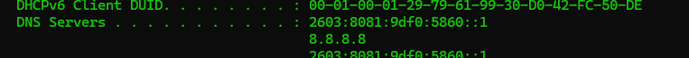

**Question 7**
**Answer:** The DNS query is a Type A or AAAA query (depending on the packet selected) and contains 0 Answer RRs.

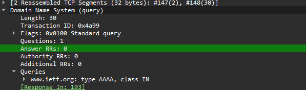

**Question 8**
**Answer:** The DNS response contained 2 Answer Resource Records (AAAA records) providing IPv6 addresses for www.ietf.org.

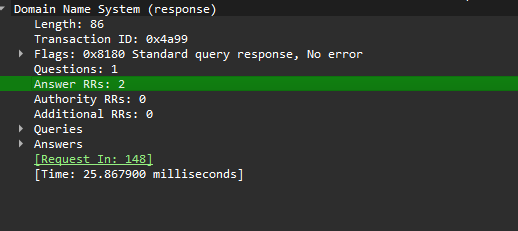
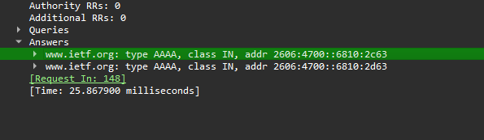

**Question 9**
**Answer:** No TCP SYN packet to the resolved web server IP addresses was observed. The browser appears to have used HTTP/3 (QUIC) or an existing connection.

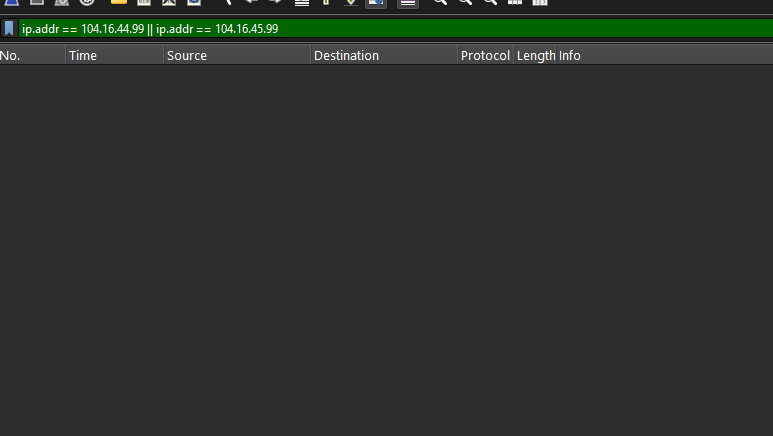

**Question 10**
**Answer:** No. The browser reused previously resolved addresses and did not issue a new DNS query before retrieving each image.

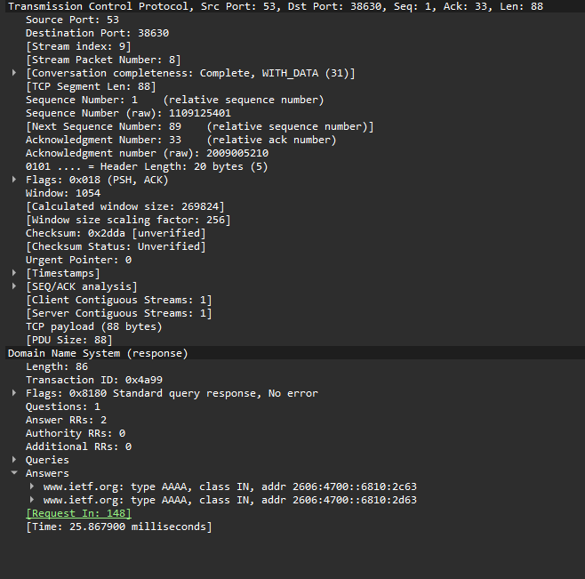

**Question 11**
**Answer:** DNS Query Destination Port: 53. DNS Response Source Port: 53.

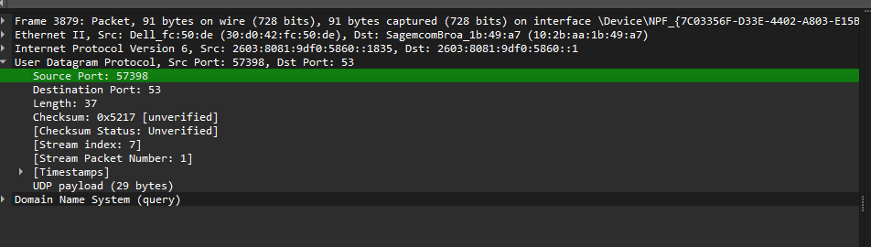
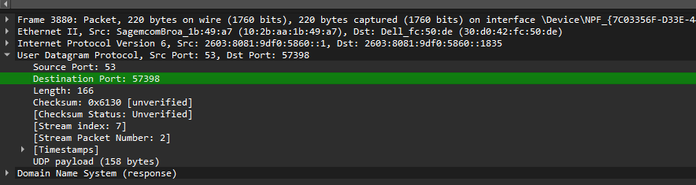

**Question 12**
**Answer:** The DNS query was sent to the configured local DNS server.

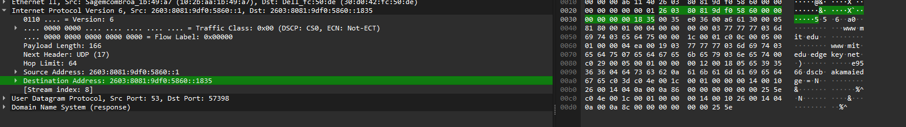

**Question 13**
**Answer:** The DNS query is a Type AAAA query for www.mit.edu and contains 0 Answer RRs.

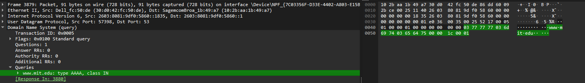

**Question 14**
**Answer:** The DNS response contains 4 Answer Resource Records: two CNAME records and two AAAA records resolving www.mit.edu through Akamai.

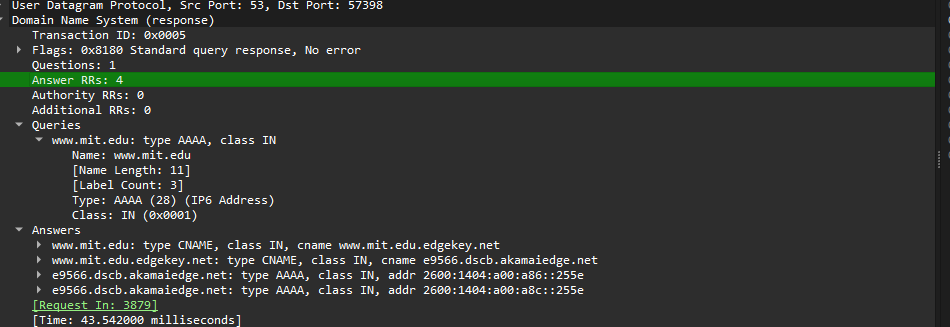

**Question 15**

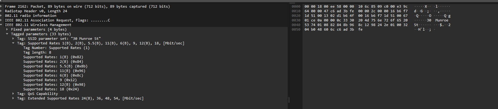

**Question 16**
**Answer:** The DNS query was sent to the configured local DNS server.

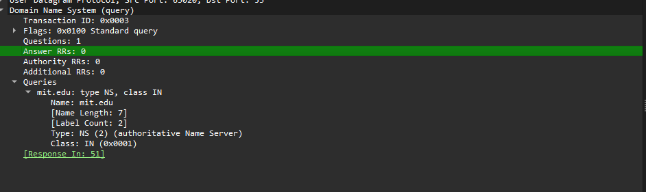

**Question 17**
**Answer:** The DNS query is a Type NS (Name Server) query for mit.edu and contains 0 Answer RRs.

**Question 18**
**Answer:** The response returned 8 authoritative NS records for mit.edu and included their IPv4 addresses in the Additional Records section.

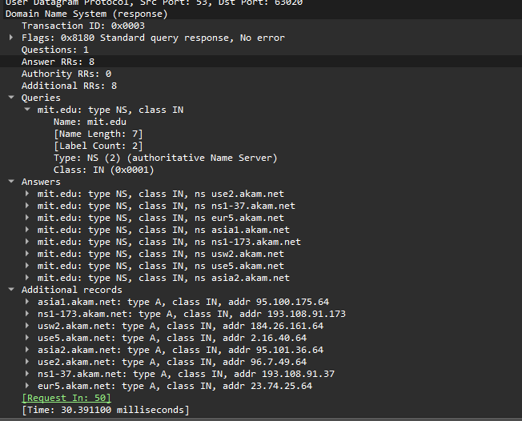

**Question 19**

**Question 20**
**Answer:** The DNS query was sent to 18.0.72.3, which corresponds to bitsy.mit.edu rather than the default local DNS server.

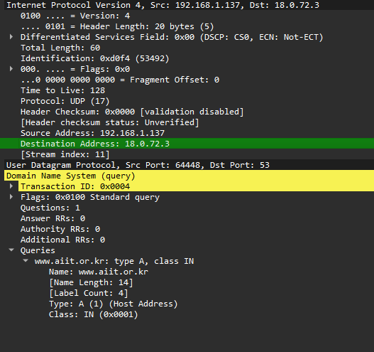

**Question 21**
**Answer:** The DNS query is a Type A (Host Address) query for www.aiit.or.kr and contains 0 Answer RRs.

**Question 22**
**Answer:** No DNS response containing Answer Resource Records was captured for the www.aiit.or.kr query. Therefore, 0 answers were provided in this capture.

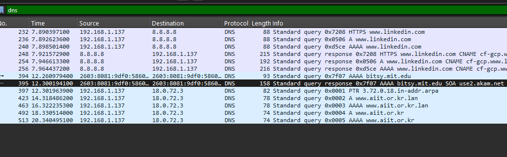

**Question 23**

