# Wireshark TCP Lab - Submission Answers

This lab uses Wireshark to capture and analyze a TCP connection, examining source/destination ports, sequence and acknowledgment numbers, connection setup, retransmission timeout estimation, flow control, and congestion control behavior.

## Question 1

Client IP: 192.168.1.137. TCP Source Port: 48109.

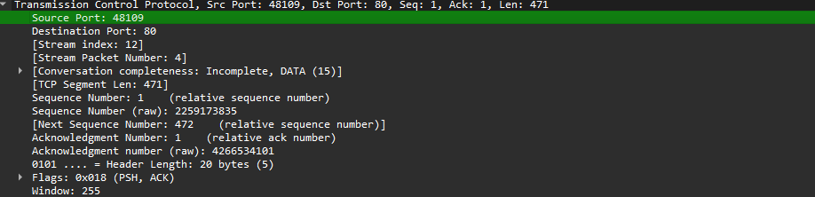

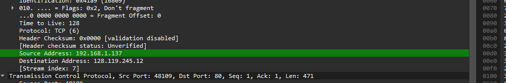

## Question 2

Server IP: 128.119.245.12. TCP Port: 80.

## Question 3

My client IP was 192.168.1.137 using source port 48109.

## Question 4

SYN sequence number: 0 (relative). The SYN flag identifies the segment as a SYN.

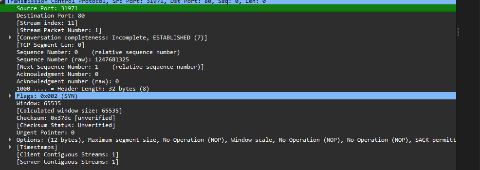

## Question 5

SYN/ACK sequence number: 0 (relative). Acknowledgment number: 1. The ACK acknowledges the client's SYN by adding 1 to its sequence number. SYN and ACK flags are both set.

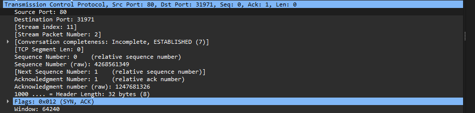

## Question 6

HTTP POST TCP sequence number: 472 (relative).

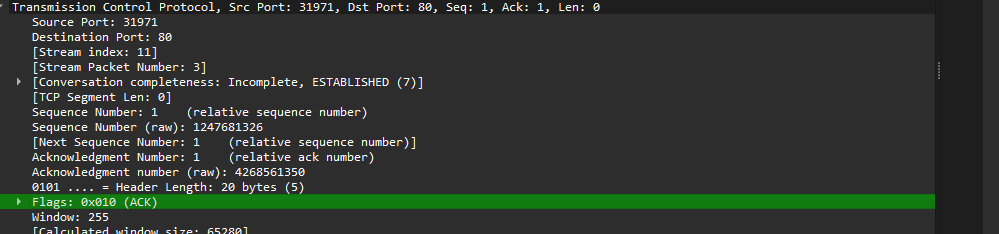

## Question 7

Only one TCP data segment was present in my capture. Sequence Number: 472. Time Sent: 5.825857200 s. ACK Received: 5.930597200 s. RTT: 0.104740 s. Estimated RTT: 0.104740 s.

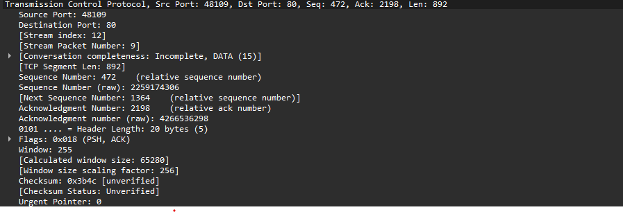

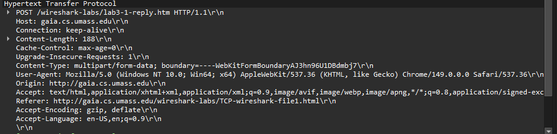

## Question 8

The TCP payload length of the first (and only) TCP data segment was 892 bytes. No additional TCP data segments were present.

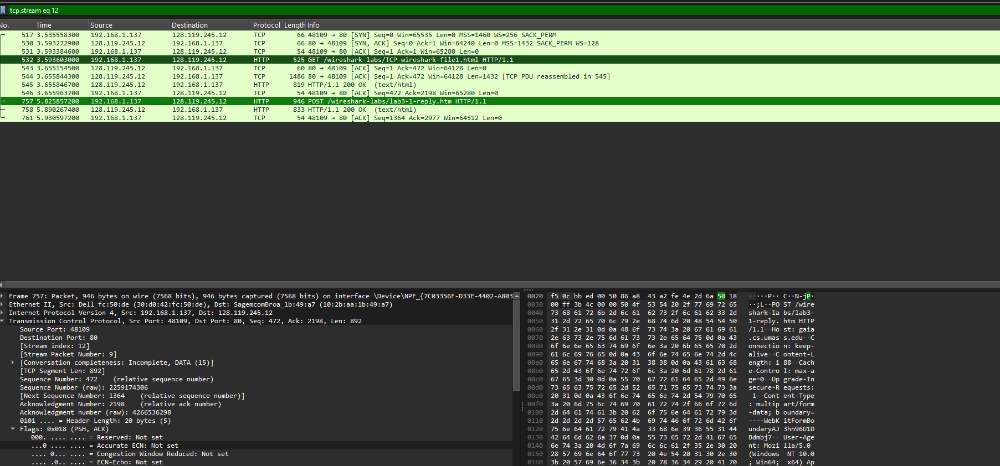

## Question 9

Minimum advertised receiver window: 64,128 bytes. The receiver buffer never became exhausted, so flow control did not throttle the sender.

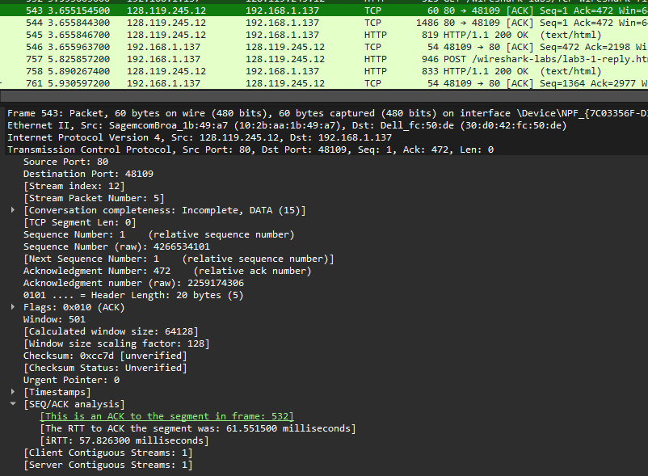

## Question 10

Using the filter `tcp.analysis.retransmission` showed retransmissions on unrelated IPv6 HTTPS traffic. No retransmissions were observed in the TCP stream analyzed for this lab.

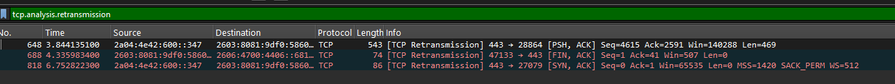

## Question 11

The receiver acknowledged each significant data segment individually. There was no evidence of delayed ACKs acknowledging every other segment.

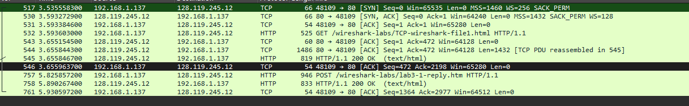

## Question 12

Throughput ≈ 892 bytes / 0.104740 s = 8,516 bytes/s (≈8.5 KB/s or ≈68.1 kbps).

## Question 13

From the Time-Sequence (Stevens) Graph, TCP Slow Start occurs at approximately 0-0.5 seconds. After about 0.5 seconds, TCP transitions into Congestion Avoidance where the sequence number increases at a more linear rate. The graph differs from the ideal model because packets are transmitted in bursts and ACK timing varies.

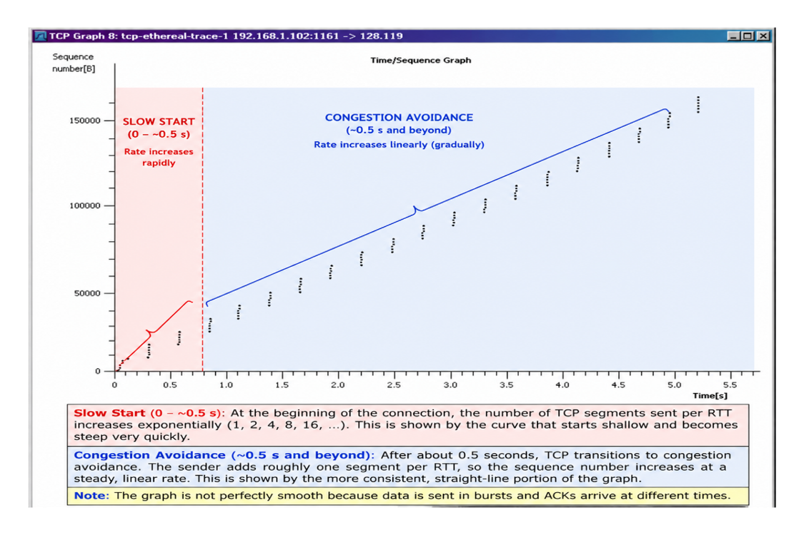

## Question 14

My own capture contained only a single TCP data segment, so it was not possible to identify Slow Start and Congestion Avoidance. Therefore, I used the provided tcp-ethereal-trace-1 sample trace to analyze TCP congestion control.

