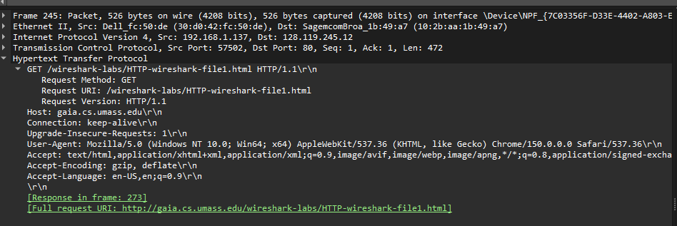
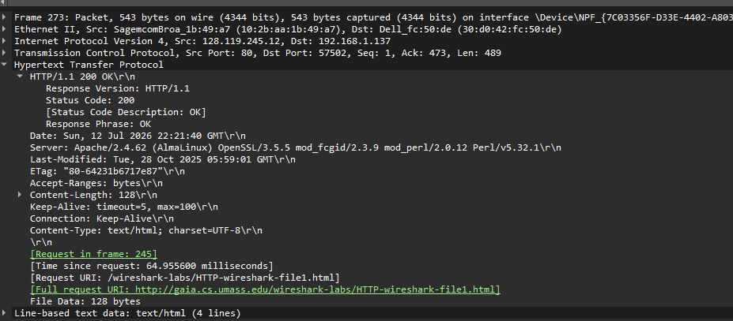
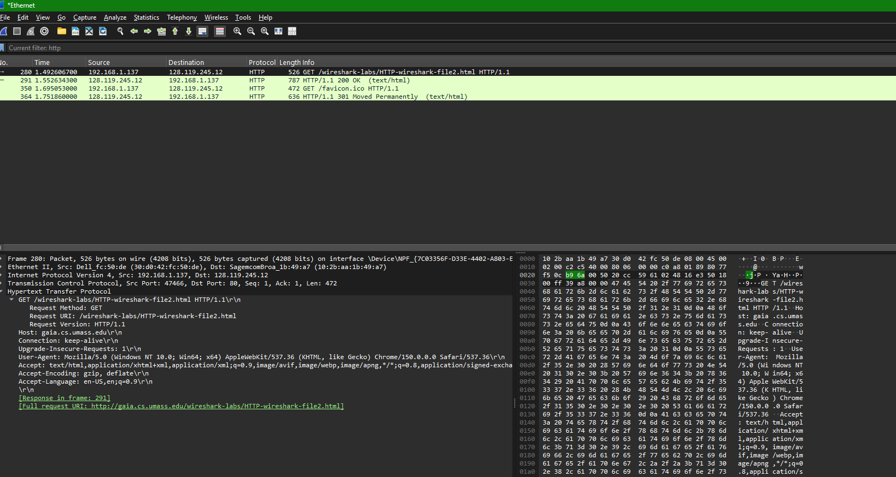
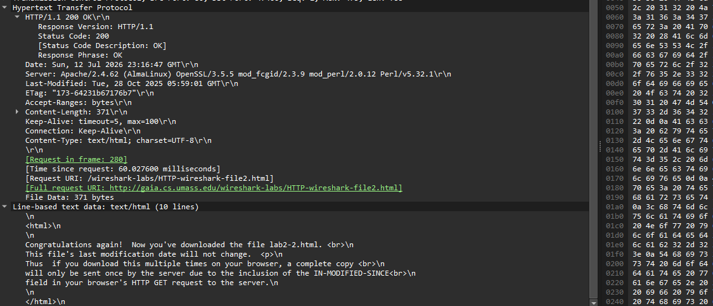
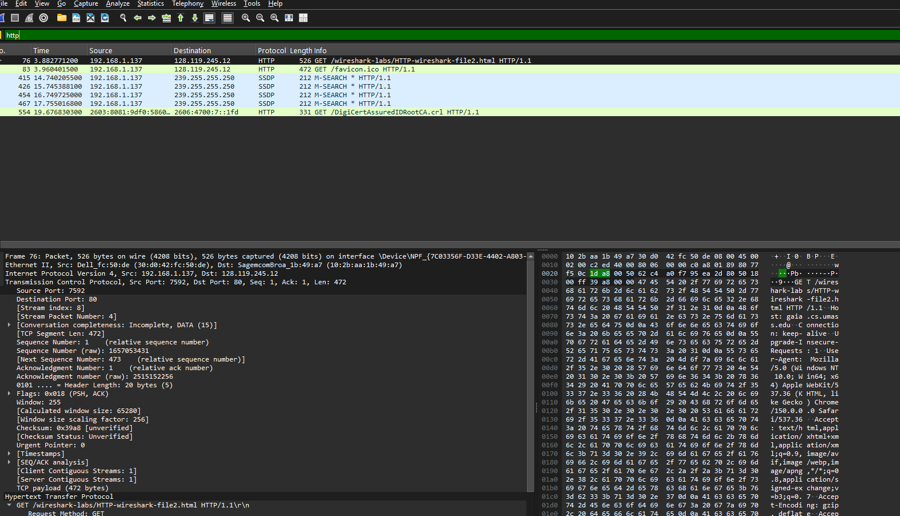
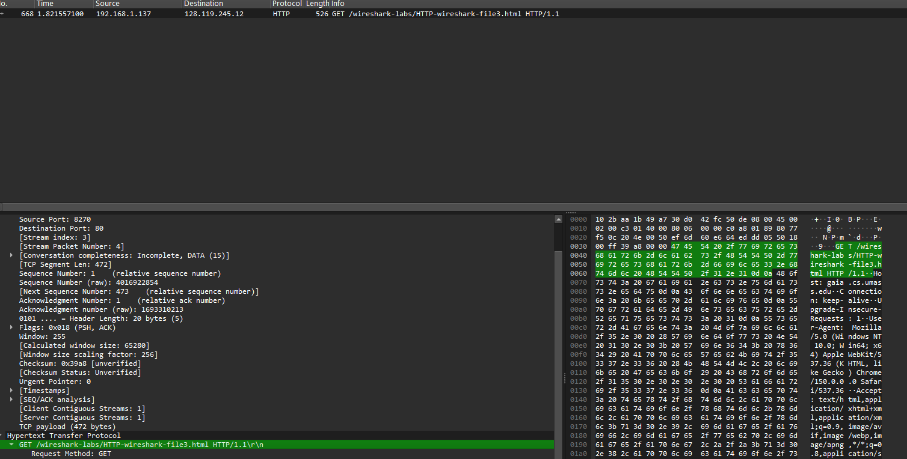
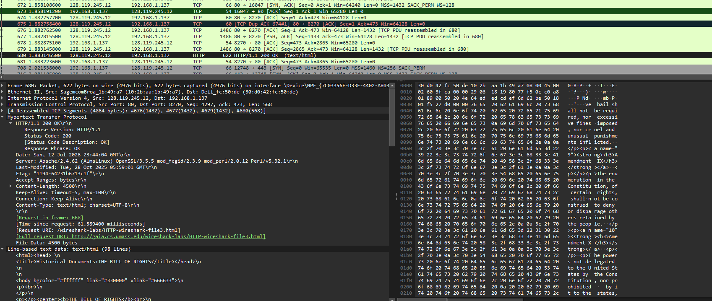
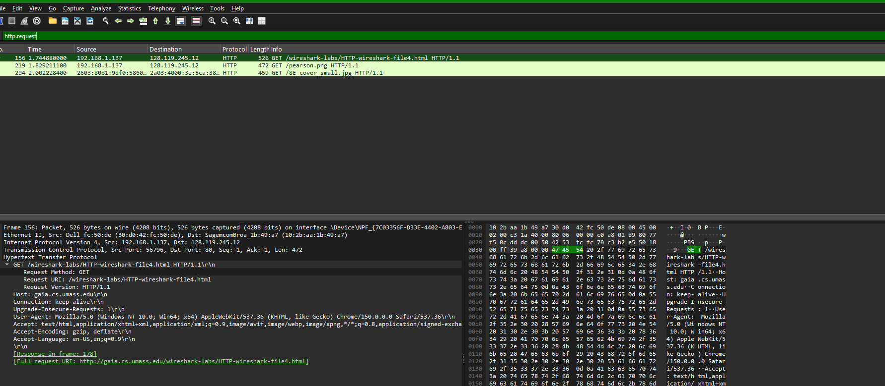
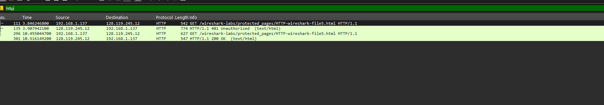
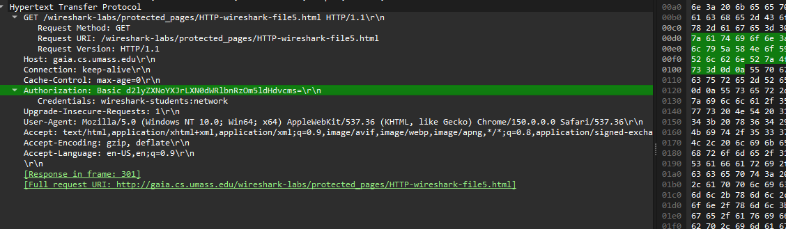

# Wireshark HTTP Lab - Submission Answers

This lab uses Wireshark to capture and analyze HTTP traffic, examining request/response headers, conditional GET (caching), persistent connections, retrieving objects referenced by an HTML page, and HTTP authentication.

## Question 1

Browser: HTTP/1.1. Server: HTTP/1.1.

## Question 2

The browser indicates it accepts U.S. English and English (Accept-Language: en-US,en;q=0.9).

## Question 3

Client IP: 192.168.1.137. Server IP: 128.119.245.12.

## Question 4

The server returned status code 200 OK.

## Question 5

The HTML file was last modified on Tue, 28 Oct 2025 05:59:01 GMT.

## Question 6

The server returned 128 bytes of content (Content-Length: 128).

## Question 7

Yes. One example is the ETag header.

## Question 8

No. The first HTTP GET request does not contain an If-Modified-Since header.

## Question 9

Yes. The server returned the HTML file. This is confirmed by the 200 OK response and the Line-based text data section.

## Question 10

Yes. The second GET contains an If-Modified-Since header with the timestamp of the cached file (or use the supplied trace if your browser did not generate a conditional GET).

## Question 11

The response is 304 Not Modified. The server does not resend the file because the browser's cached copy is still valid.

## Question 12

One HTTP GET request was sent for the Bill of Rights page. The GET request is packet 668.

## Question 13

Packet 680 contains the response status code and phrase.

## Question 14

The response status is 200 OK.

## Question 15

Four TCP segments (#676, #677, #679, and #680) carried the HTTP response.

## Question 16

Three HTTP GET requests were sent: the HTML page, pearson.png, and 8E_cover_small.jpg.

## Question 17

The images were downloaded in parallel because the browser issued the image requests almost immediately after receiving the HTML.

## Question 18

The server responded with HTTP/1.1 401 Unauthorized.

## Question 19

The second HTTP GET includes an Authorization: Basic header containing the Base64-encoded credentials.

