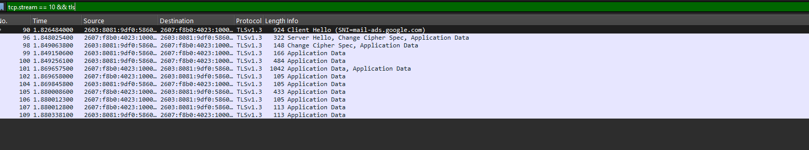
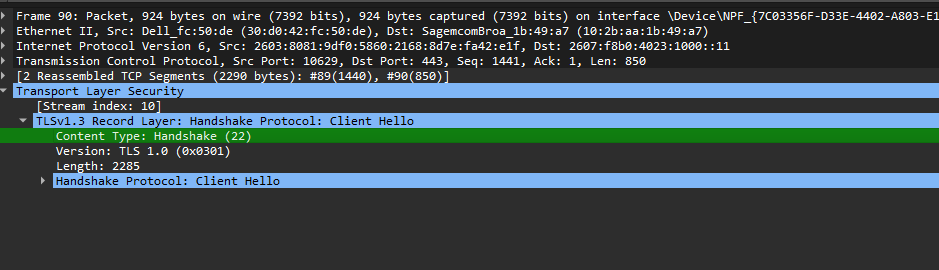
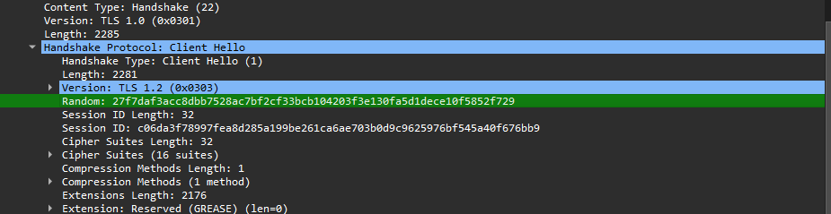
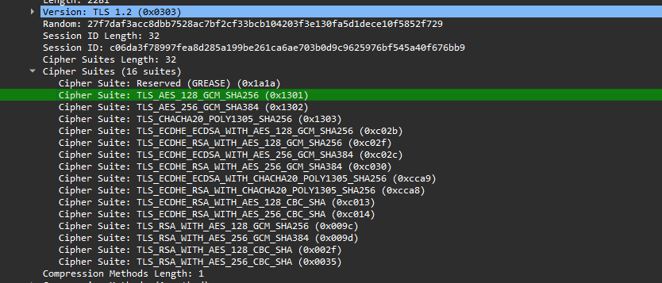
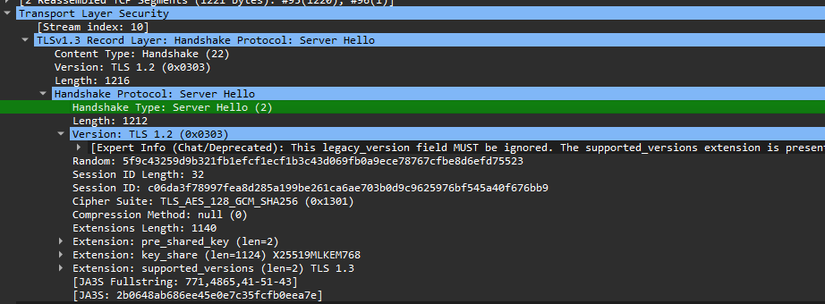
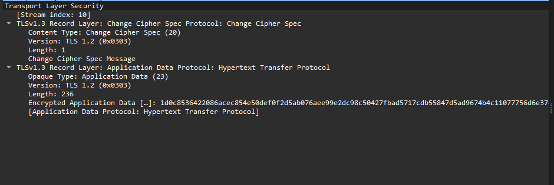
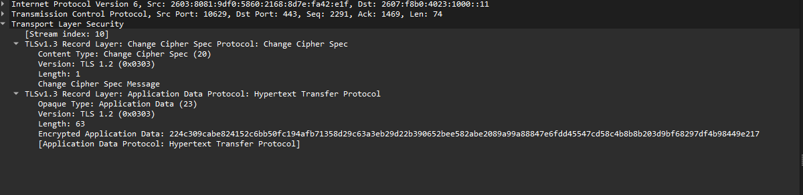

# Wireshark SSL Lab - Submission Answers

This lab uses Wireshark to capture and analyze a TLS/SSL session, examining the handshake sequence, TLS record structure, cipher suite negotiation, and how TLS 1.3 encrypts handshake and application data.

## Question 1

For the first eight TLS frames, the client begins with a Client Hello. The server responds with a Server Hello, Change Cipher Spec, and encrypted Application Data. The client then sends Change Cipher Spec and encrypted Application Data, followed by additional encrypted Application Data records from the server. Timing diagram should reflect this sequence.

## Question 2

Each TLS record begins with three fields: Content Type (1 byte), Version (2 bytes), and Length (2 bytes). In this capture: Content Type = Handshake (22), Version = TLS 1.0 (legacy record version 0x0301), Length = 2285 bytes.

## Question 3

The ClientHello Content Type is Handshake (22).

## Question 4

Yes. The ClientHello contains a 32-byte random nonce (challenge): 27f7daf3acc8dbb7528ac7bf2fcf33bcb104203f3e130fa5d1dece10f5852f729.

## Question 5

Yes. The client advertises supported cipher suites. Ignoring the GREASE entry, the first supported suite is TLS_AES_128_GCM_SHA256 (ECDHE key exchange in TLS 1.3, AES-128-GCM encryption, SHA-256 hash).

## Question 6

The ServerHello selects TLS_AES_128_GCM_SHA256.

## Question 7

Yes. The ServerHello contains a 32-byte random value used with the client random to derive unique session keys and prevent replay.

## Question 8

Yes. A Session ID is present and supports session identification/resumption.

## Question 9

In TLS 1.3 the certificate is encrypted after the ServerHello, so Wireshark does not display it without session keys.

## Question 10

TLS 1.3 does not send a separate Client Key Exchange or transmitted pre-master secret. A shared secret is derived using ECDHE.

## Question 11

Change Cipher Spec indicates the transition to encrypted communication. Record length in this capture is 1 byte.

## Question 12

The remaining handshake messages are encrypted using the negotiated TLS 1.3 session keys with AES-128-GCM.

## Question 13

Yes. The server also sends Change Cipher Spec and encrypted handshake/application data. The encrypted contents differ because they contain the server-side handshake messages.

## Question 14

Application data is encrypted with TLS_AES_128_GCM_SHA256. AES-GCM provides confidentiality and integrity (authentication tag), so there is no separate MAC visible.

## Question 15

Interesting observation: TLS 1.3 encrypts most handshake messages after the ServerHello, providing greater privacy than older TLS versions.

